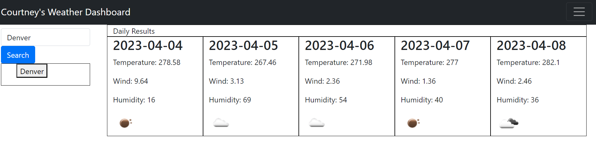

# weatherApp

## Description 
// The scope of this project is to build a weather dashboard that will run in the browser and feature dynamically updated HTML and CSS. 

## Project URL
 https://github.com/csherman177/weatherApp 

## Deployment
https://csherman177.github.io/weatherApp/

## Demo/Screenshots
  <table>
  <tr>
    <td>Weather Dashboard</td>
  </tr>
  <tr>
    <td></td>
  </tr>
  </table>
 
  ## Contact
  Email: csherman177@gmail.com

  ## Author
  Author(s): Courtney Sherman 
  GitHub: https://github.com/csherman177/ 